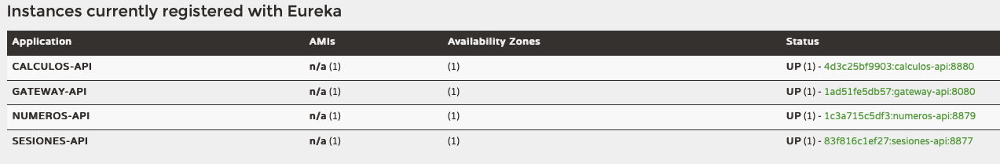
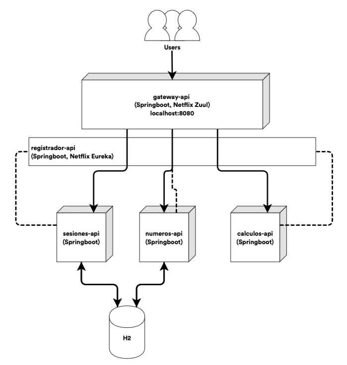

# Calculadora
Este proyecto está compuesto por las siguientes apis:

Api  | Detalle
------------- | -------------
registrador-api  | Servidor de Eureka que registra y monitorea el estado de las apis 
gateway-api  | Api que provee un solo punto de acceso a las apis
sesiones-api  | Encargado de la administración de las sesiones del ambiente
numeros-api   | Api encargada de la administración de los numeros por sesion del ambiente
calculos-api   | Encargado de la administración de los numeros por sesion del ambiente

Este entorno se debe ejecutar en el siguiente orden:

No | Api  | Readme
------------- |------------- | -------------
1 |registrador-api  | [Readme](registrador-api/readme.md)
2 |gateway-api  | [Readme](gateway-api/readme.md)
3 |sesiones-api  | [Readme](sesiones-api/readme.md)
4 |numeros-api   | [Readme](numeros-api/readme.md)
5 |calculos-api   | [Readme](calculos-api/readme.md)

Cerciore que todas las apis aparezcan registradas [aquí](http://localhost:8761)

### Diagrama

Cualquier información adicional no dude en contactarme a [roldanhollow@gmail.com](mailto:roldanhollow@gmail.com)
Enjoy!
